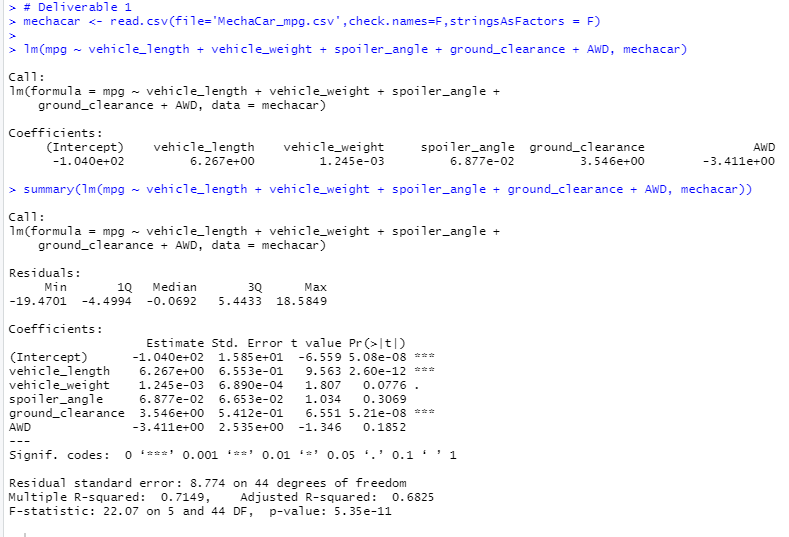
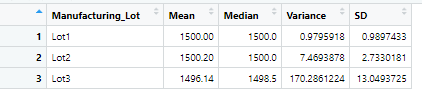
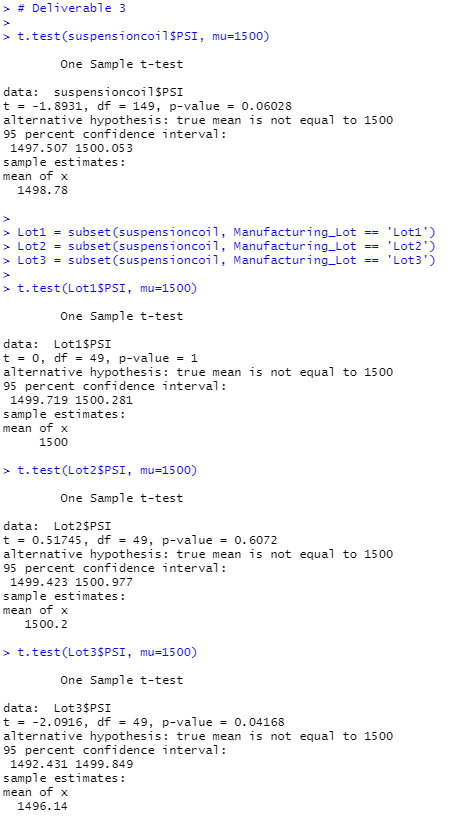

# MechaCar_Statistical_Analysis

## Purpose

## Results and Summary

### Linear Regression to Predict MPG

3 Takeaways:
1. Variance of a non-random variable is typically zero (0). Taking that into consideration, the coefficients for the intercept, vehicle_length, and ground_clearance all provide a non-random amount of variance.
2. The slope of the linear model would be considered zero if the null hypothesis is accepted. However, the p-value < 0.05, indicating that the null hypothesis can be rejected so the slope cannot be considered zero.
3. When performing a line regression, the r-squared value should be as close to 1 as possible. Based on the multiple r-squared value (0.71) and adjusted r-squared value (0.68), the linear model predicts mpg well, but a different statistical test is recommended. 

### Summary Statistics on Suspension Coils

Looking at the overall variance, the suspension coils meet the design specifications. However, when separating the lots individually, lot 3 exceeds the 100 pounds per square inch specification.

### T-Tests on Suspension Coils

Performing a t-test on the entire lot, the p-value > 0.05, indicating that the correlation is not significant and the null hypothesis cannot be rejected. Based on the t-value, there is a small confidence level, which means that there is a possibility of rejecting the null. In this case, a small confidence level indicated accepting the null hypothesis.

### Study Design: MechaCar vs Competition
